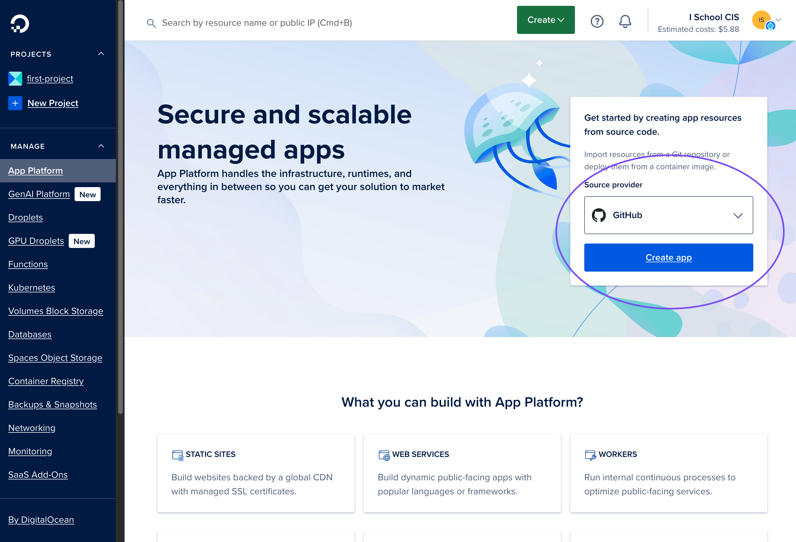
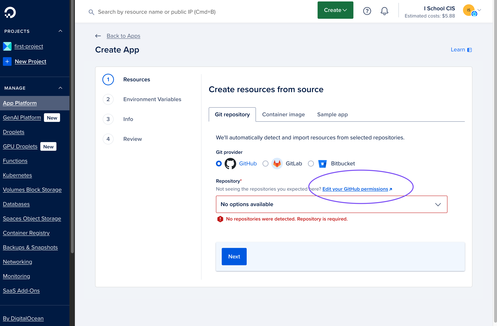
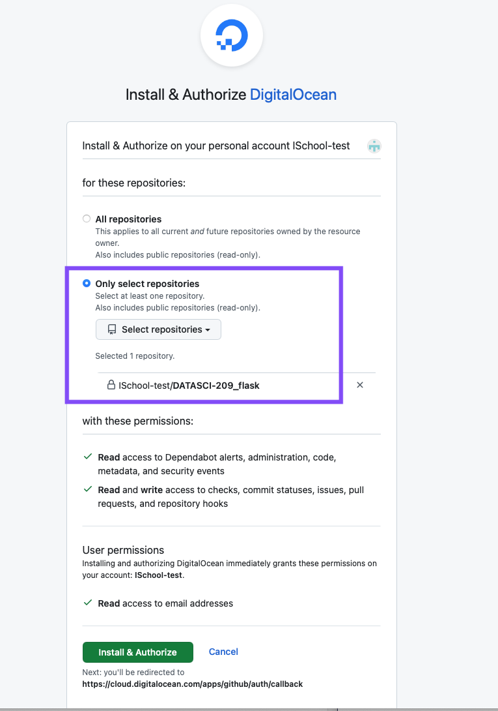
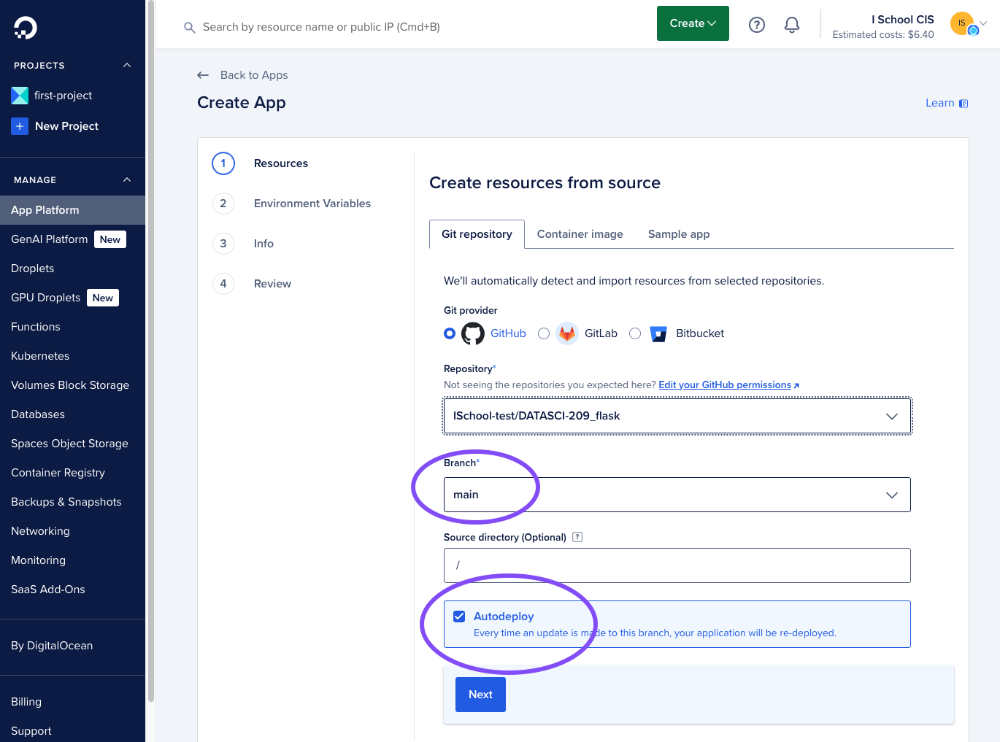
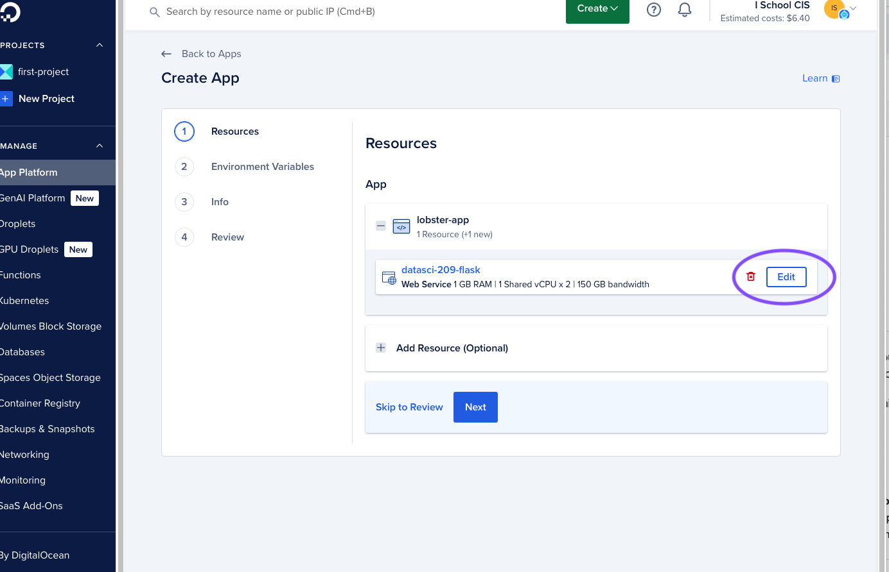
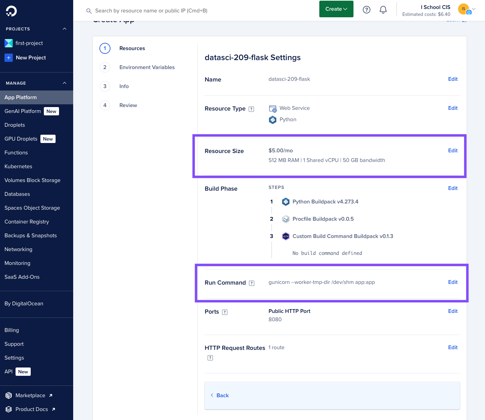
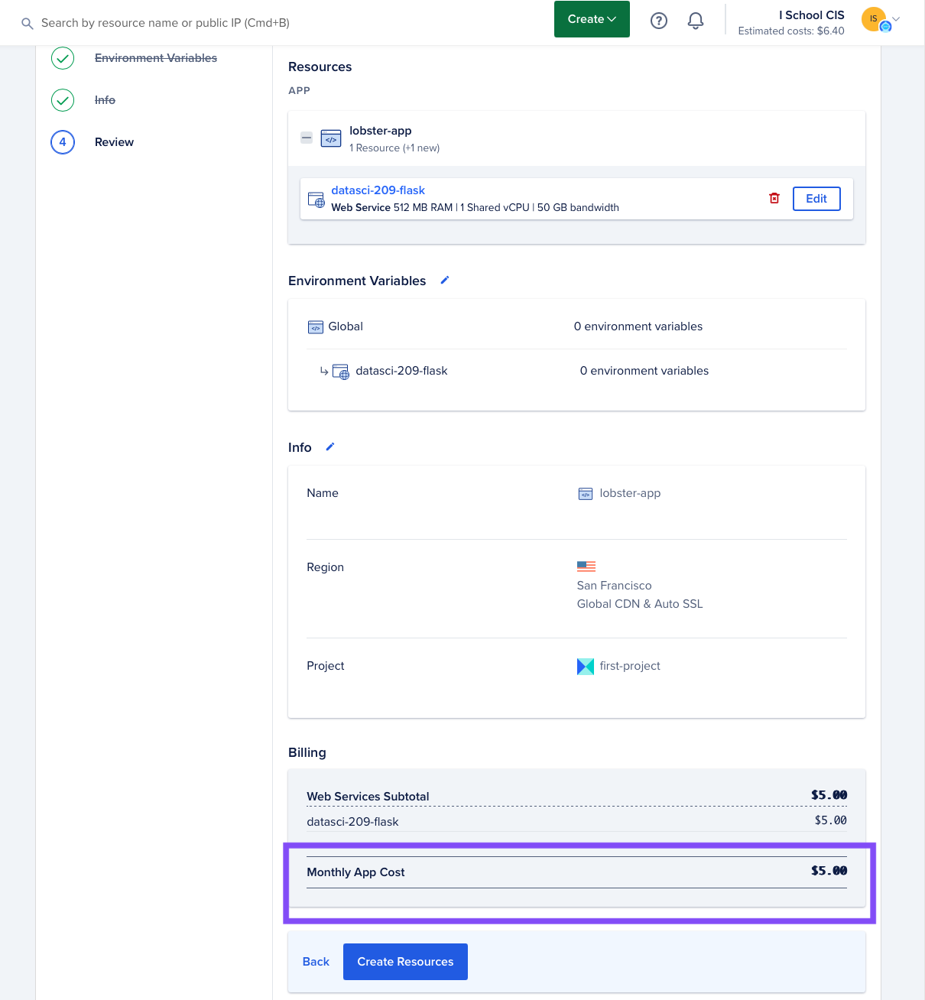
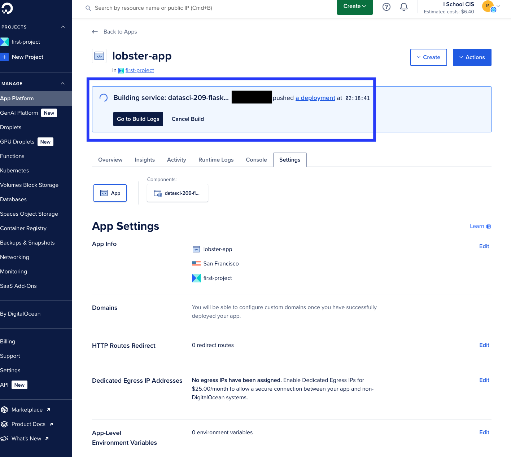
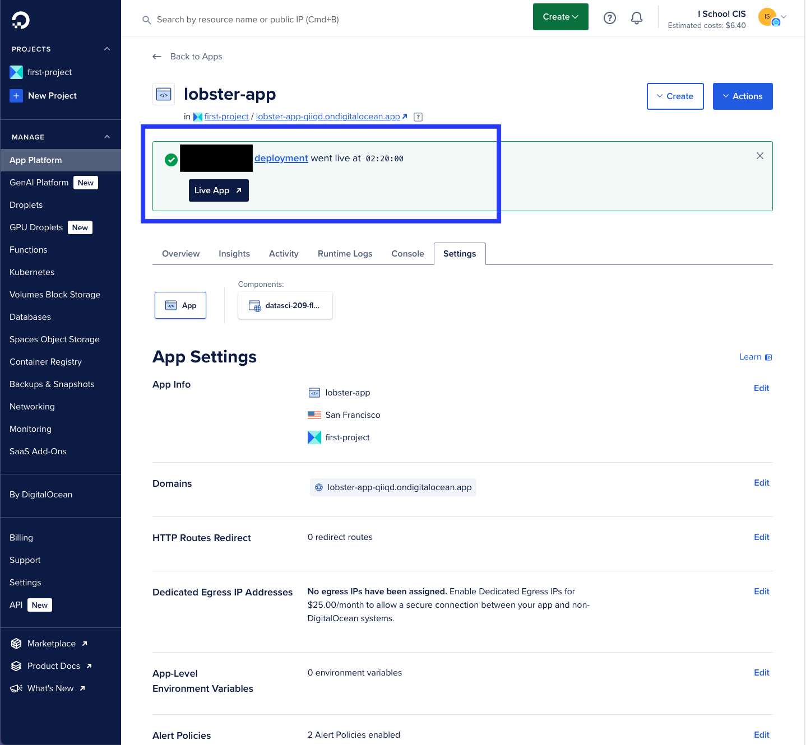

# DATASCI 209 flask template

This repo provides a basic flask app for DATASCI 209 students and instructors. You can run this flask app locally for development/debugging or deploy it to Digital Ocean's [App Platform](https://www.digitalocean.com/products/app-platform).

## Getting Started

1. Install Python 3.x on your computer.
2. [Create a copy](https://docs.github.com/en/repositories/creating-and-managing-repositories/creating-a-repository-from-a-template#creating-a-repository-from-a-template) of this repo in your personal GitHub workspace. For example, if your GitHub username is **octocat**, you would make octocat the owner of your copy of the repository.
```
DO NOT create your copy of this repo in a GitHub organization owned by someone else
or you might not be able to deploy your flask application to Digital Ocean's App Platform.
```
3. Clone your copy of this repo from GitHub to your computer.

## Local Development

**Install dependencies**

Open a terminal and navigate to the folder that contains your local copy of this repo.  Run the following command to install the necessary Python libraries:

**Mac**
```
pip3 install -r requirements.txt
```

**Windows**
```
py -m pip install -r requirements.txt
```

See the [pip documentation](https://pip.pypa.io/en/stable/cli/pip_install/) if you need more information about installing Python libraries with pip.

**Run your app locally**

In the folder where you cloned a copy of this repo, run the following command.  The --debug option will cause flask to automatically load any code changes you make.

```
flask --app app.py --debug run
```

**Point your browser to http://127.0.0.1:5000**

When running your app locally with the --debug flag, flask's built-in debugger will provide an interactive traceback in your browser.  You can also use an external debugger such as the one in your preferred IDE to troubleshoot your code.  See the flask [Debugging Application Errors](https://flask.palletsprojects.com/en/stable/debugging/) documentation for more information on debugging your flask app.

## Hosting your flask app on Digital Ocean

Digital Ocean provides a public cloud platform that you can use to host your flask app.  See [How To Deploy a Flask App Using Gunicorn to App Platform](https://www.digitalocean.com/community/tutorials/how-to-deploy-a-flask-app-using-gunicorn-to-app-platform) for an overview of how their flask app hosting works.

**Please note**

1. Digital Ocean does not offer free App Platform hosting.  The smallest App Platform VM costs $5 per month as of October 2024.
2. DATASCI 209 students and instructors may be eligible for a free higher education credit from Digital Ocean.  See Digital Ocean's [higher education](https://www.digitalocean.com/landing/do-for-higher-education) page for more information.
3. Automatically deploying your code changes to App Platform requires installing the Digital Ocean GitHub app.  It's easier to set up this app in your personal GitHub workspace than in a GitHub organization owned by someone else.  For this reason, we recommend that you keep your flask app repo in your personal GitHub workspace.

**How to deploy your flask app to Digital Ocean**

1. Create a [Digital Ocean](https://www.digitalocean.com) account.

2. Navigate to the [App Platform Homepage](https://cloud.digitalocean.com/apps)

3. Select 'Create App' using GitHub as the Source provider
  

4. You will likely see that Digital Ocean doesn't detect any of your GitHub repos.  If so, select 'Edit your GitHub permissions'.
  

5. You will be prompted to install and authorize the Digital ocean GitHup app.  For security, it's a good idea to only grant the Digital Ocean GitHub app access to your copy of the DATASCI 209 flask template repo.
  

6. After you grant the Digital Ocean GitHub app access to your repo, make sure it's tracking the main branch of your repo and that autodeploy is enabled.  This will automatically deploy any updates to the main branch of your repo to Digital Ocean's app platform.
  

7. Next, you will need to edit your app settings.  In the example below, Digital Ocean has assigned the name 'lobster-app' to this flask application.  These names are randomly generated.  Your app may be called something different like 'lionfish-app' or 'jellyfish-app'
  

8. You will need to edit two app settings:
  * **Resource Size**: The default resource size costs $12 per month. Change that to the smallest resource size, which costs $5 per month.  Unless your flask app is doing something resource intensive on the back end, the smallest Digital Ocean resource size should be fine.
  * **Run Command**: Replace the default run command with the following:
  ```
   gunicorn --worker-tmp-dir /dev/shm app:app
   ```
  

9. After you save your app settings, you will see a summary screen for your app.  Verify that the monthly app cost is $5, then select 'Create Resources'
  

10. After you click the Create Resources button, you will see a web page that displays the progress of your app's build and deployment process.  You can view the build and deploy logs if you need to troubleshoot a failed deployment
  

11. After your deployment completes, select 'Live App' to view your flask app in a web browser.
  
`
12. Be sure to bookmark your flask app's URL so you can find it without using the Digital Ocean web UI.

